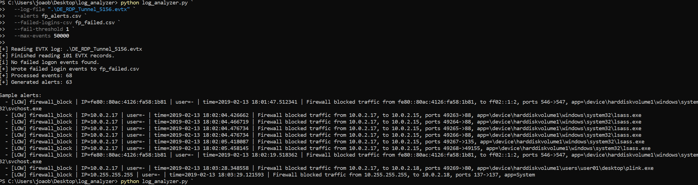
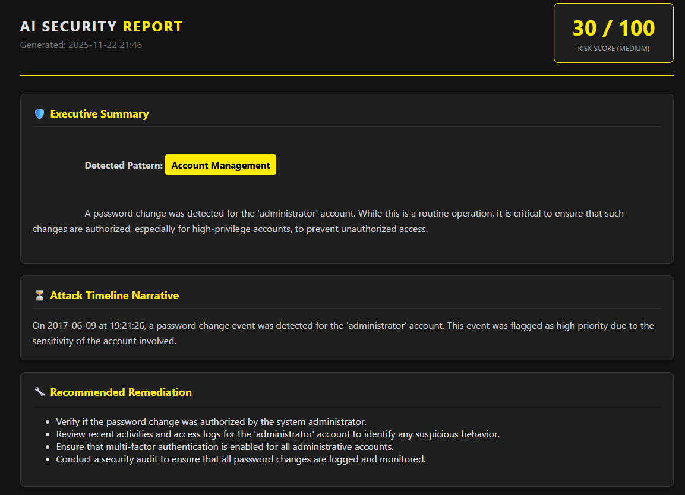
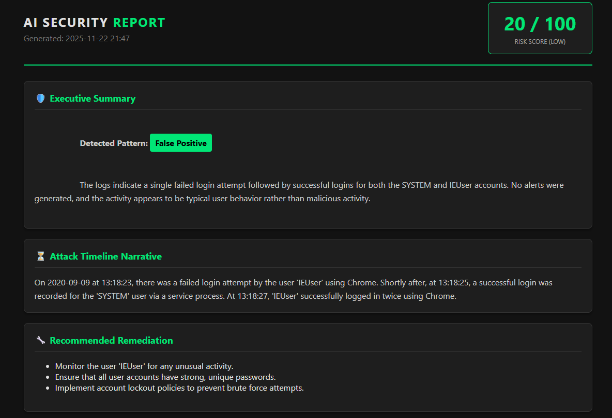
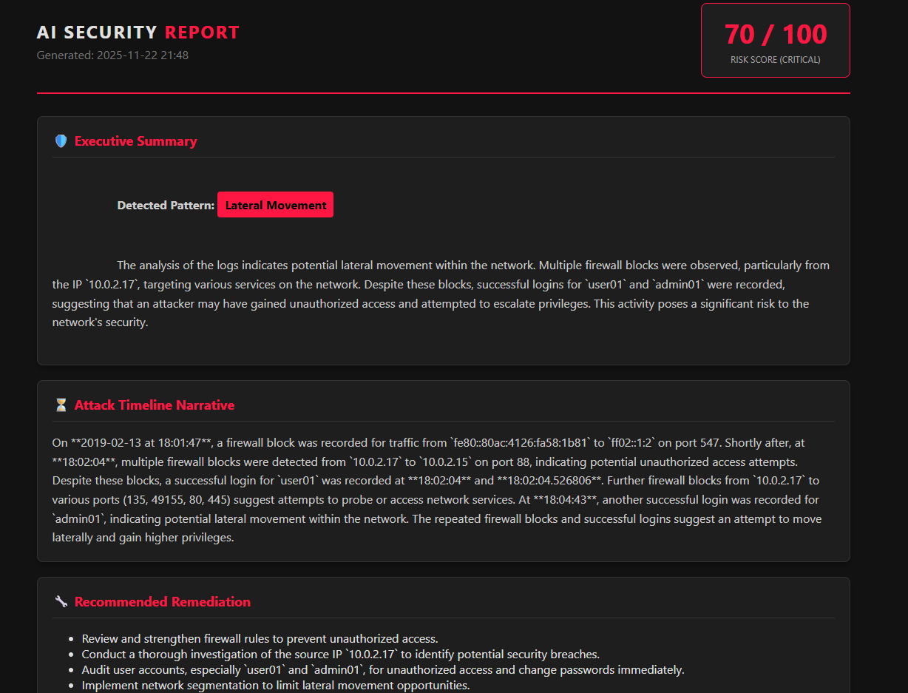
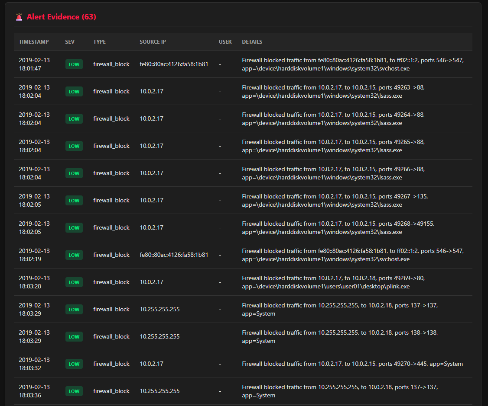
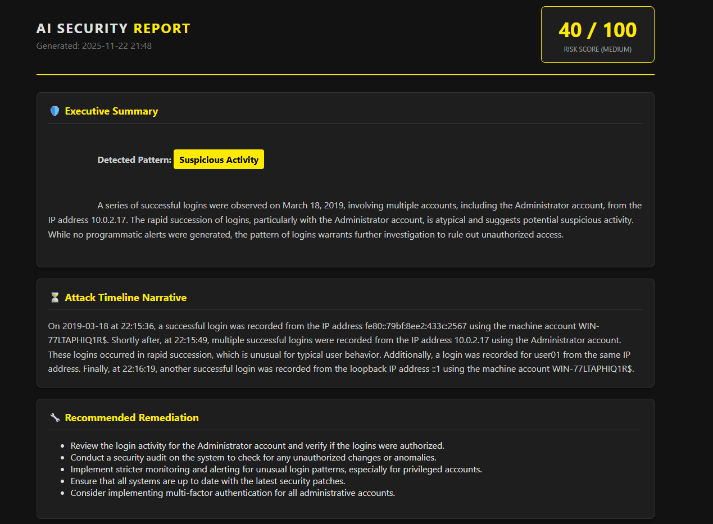

# AI Security Log Summarizer

A Python + AI-powered Windows security log analyzer that turns raw .evtx logs into SOC-grade incident reports with risk scoring, timelines, and remediation.

[](https://www.python.org/)
[](#license)


---

## 1. High-Level Overview

The project has two main components:

1. **`log_analyzer.py`** – local, deterministic analysis  
   - Parses text logs or Windows `.evtx` (Security log).  
   - Detects failed logons, firewall blocks, password changes, account lockouts, and correlation patterns.  
   - Emits structured `Alert` objects and optional CSV exports.

2. **`ai_log_summarizer.py`** – AI-powered summarization layer  
   - Uses `LogAnalyzer` as a pre-filter.  
   - Sends a compact summary of events + alerts to OpenAI (Tier 3 SOC-style prompt).  
   - Receives strict JSON with:
     - `risk_score` (0–100)
     - `classification` (Brute Force, Lateral Movement, Recon, False Positive, etc.)
     - `timeline_narrative`
     - `executive_summary`
     - `remediation_steps`
   - Generates a dark-mode HTML report and opens it in the browser.

Conceptual flow:

```text
          Raw Logs (.evtx / text)
                     │
                     ▼
       ┌─────────────────────────┐
       │      LogAnalyzer        │
       │  - Parse & normalize    │
       │  - Detect patterns      │
       └─────────┬───────────────┘
                 │ events + alerts
                 ▼
       ┌─────────────────────────┐
       │   AI Log Summarizer     │
       │  - Build prompt         │
       │  - Call OpenAI JSON API │
       └─────────┬───────────────┘
                 │ ai_results
                 ▼
       ┌─────────────────────────┐
       │  HTML Report Generator  │
       │  - Score card           │
       │  - Timeline             │
       │  - Evidence table       │
       └─────────────────────────┘
````

---

## 2. Project Structure

```text
src/
  log_analyzer.py        # Local rule-based analyzer (no external APIs)
  ai_log_summarizer.py   # Orchestrator: analyzer + OpenAI + HTML report

samples/                 # EVTX samples (see sbousseaden/EVTX-ATTACK-SAMPLES)
reports/
  ca_logon_report.html
  dsrm_report.html
  investigation_report.html
  rdp_firewall_report.html
  wmi_activity_report.html

example.env              # Template for environment variables (no secrets)
requirements.txt
README.md
```

The HTML reports in `reports/` are sample outputs showing different scenarios (false positive, recon, password change, lateral movement, etc.).

---

## 3. Installation

### Prerequisites

* Python 3.10+ recommended
* OpenAI API key

### Install dependencies

```bash
pip install -r requirements.txt
```

Example `requirements.txt` (adjust as needed):

```txt
openai>=1.40.0
python-dotenv>=1.0.0
python-evtx>=0.7
```

---

## 4. Configuration

Create a `.env` file in the project root (do **not** commit this file):

```env
OPENAI_API_KEY=YOUR_REAL_KEY_HERE
```

`ai_log_summarizer.py` loads this via `python-dotenv` and instantiates the OpenAI client.

Use `example.env` as a safe template for others.

---

## 5. CLI Usage

### 5.1 Log Analyzer (local, rule-based)

`log_analyzer.py` can be used on its own to quickly scan logs and export alerts to CSV.

Basic usage:

```bash
python src/log_analyzer.py \
  --log-file path/to/Security.evtx \
  --alerts alerts.csv
```


Supported options (from `parse_args()`):

* `--log-file` **(required)**
  Path to the log file (text or `.evtx`).

* `--alerts` (default: `alerts.csv`)
  Output CSV path for generated alerts.

* `--fail-threshold` (default: `5`)
  Number of failed logons per IP/username to trigger **brute force** or **targeted account** alerts.

* `--max-events` (default: `50000`)
  Max events to read when parsing `.evtx` files – safety valve to avoid loading massive logs.

* `--failed-logins-csv` (optional)
  If set, exports **all** failed logon events (even below alert threshold) to a separate CSV.

Example: export everything for offline analysis:

```bash
python src/log_analyzer.py \
  --log-file Security.evtx \
  --alerts alerts.csv \
  --failed-logins-csv failed_logons.csv \
  --fail-threshold 3 \
  --max-events 100000
```

#### What the analyzer actually does

From `log_analyzer.py`:

* Normalizes events into a `LogEvent` dataclass (timestamp, IP, username, event_type, raw_line, data).
* Uses:

  * Regexes for failed login phrases, firewall blocks, etc. in text logs.
  * A mapping of Windows Event IDs (4625, 4624, 4740, 4794, 5156, …) in EVTX logs.
* Tracks:

  * Count of failed logons per IP and per username.
  * Account lockouts (Event 4740).
  * Password changes (Event 4794 and similar).
  * “Failed-then-success” patterns that can indicate password guessing.
* Emits `Alert` objects with:

  * `severity` (LOW / MEDIUM / HIGH)
  * `event_type` (e.g. `brute_force_suspected`, `account_lockout`, `password_change`)
  * `source_ip`, `username`
  * Rich `details` string.
* Writes alerts to CSV and prints summaries to stdout, including top attacking IPs and top targeted accounts.

---

### 5.2 AI Summarizer + HTML Reports

`ai_log_summarizer.py` runs the analyzer, compresses the results, sends them to OpenAI, and builds a dark-mode HTML report.

Basic usage:

```bash
python src/ai_log_summarizer.py \
  --log-file path/to/Security.evtx \
  --model gpt-4o \
  --output investigation_report.html \
  --fail-threshold 5
```

CLI options:

* `--log-file` **(required)**
  Path to a text log or `.evtx` file.

* `--model` (default: `gpt-4o`)
  Any compatible OpenAI chat model.

* `--output` (default: `report.html`)
  Output HTML filename.

* `--fail-threshold` (default: `5`)
  Passed through to `LogAnalyzer` to control brute-force detection sensitivity.

#### Prompting strategy

The script:

1. Builds `events_str` – a compact textual representation of up to `max_events` normalized events, including IPs, usernames, timestamps, and selected EventData fields like `SourceAddress`, `DestAddress`, `DestPort`, `ProcessName`, etc.
2. Builds `alerts_str` – a list of alerts with timestamp, severity, event type, source IP, username, and details.
3. Sends them with a strict system prompt instructing the model to behave as a **Tier 3 SOC Analyst** and to respond with a **valid JSON object** with exactly 5 keys:

   * `risk_score` (0–100)
   * `classification`
   * `timeline_narrative`
   * `executive_summary`
   * `remediation_steps` (list of strings)
4. Parses the JSON and injects the values into the HTML template.

If the API fails, a fallback JSON with `classification: "Error"` and generic remediation hints is returned.

#### HTML report layout

The generated report includes:

* Header with **generated timestamp**
* **Risk Score card** (color-coded: GREEN / YELLOW / RED based on score)
* **Executive Summary** block with the classification tag
* **Attack Timeline Narrative** (Markdown-style narrative)
* **Recommended Remediation** bullet list
* **Alert Evidence** table, listing each alert with:

  * Timestamp
  * Severity badge (LOW / MEDIUM / HIGH)
  * Event type
  * Source IP
  * User
  * Details

After writing the HTML, the script opens it in your default browser automatically.

---

## 6. Sample EVTX Scenarios (Purple SOC Lab)

The following examples use event samples sourced from the public EVTX attack dataset **[EVTX-ATTACK-SAMPLES](https://github.com/sbousseaden/EVTX-ATTACK-SAMPLES)** by `sbousseaden`.
They are ideal for validating detection logic and AI summarization output.

Assuming the samples are stored at:

```text
C:\Users\joaob\Desktop\ai_log_analyzer\samples\
```

> Note: Here we call the script directly (`python ai_log_summarizer.py`) as you would from the project root.

---

### ▶ 4794 — Password Change (DSRM)

This one should produce a **HIGH severity** password-change alert.

```bash
python ai_log_summarizer.py --log-file "C:\Users\joaob\Desktop\ai_log_analyzer\samples\4794_DSRM_password_change_t1098.evtx" --output dsrm_report.html
```

---

### ▶ 4624/4625 — Logon + Failed Logon Sample

```bash
python ai_log_summarizer.py --log-file "C:\Users\joaob\Desktop\ai_log_analyzer\samples\CA_4624_4625_LogonType2_LogonProc_chrome.evtx" --output ca_logon_report.html
```

---

### ▶ 5156 — Firewall Block + RDP Tunnel Sample

```bash
python ai_log_summarizer.py --log-file "C:\Users\joaob\Desktop\ai_log_analyzer\samples\DE_RDP_Tunnel_5156.evtx" --output rdp_firewall_report.html
```


---

### ▶ 4624 + 4688 — WMI Execution Sample

```bash
python ai_log_summarizer.py --log-file "C:\Users\joaob\Desktop\ai_log_analyzer\samples\LM_WMI_4624_4688_TargetHost.evtx" --output wmi_activity_report.html
```

---

## 7. Example Workflows

### 7.1 Quick “Is this normal?” check

```bash
python src/ai_log_summarizer.py \
  --log-file exported_security_log.evtx
```

Use this when you get a log bundle from a lab or a customer and want a fast **risk score + narrative**.

### 7.2 Rule-only triage on a big log

```bash
python src/log_analyzer.py \
  --log-file huge_security.evtx \
  --alerts triage_alerts.csv \
  --fail-threshold 8 \
  --max-events 200000
```

Then open `triage_alerts.csv` in Excel and filter by severity.

### 7.3 Export all failed logons for hunt

```bash
python src/log_analyzer.py \
  --log-file Security.evtx \
  --alerts alerts.csv \
  --failed-logins-csv failed_logons.csv
```

Use `failed_logons.csv` to pivot by IP / username in a SIEM, notebook, or Excel.

---

## 8. Example Reports

The `reports/` folder contains pre-generated HTML examples:

* `ca_logon_report.html` – single failed logon, then normal logons → **False Positive / LOW**.
* `dsrm_report.html` – administrator password change → **Account Management / MEDIUM**.
* `investigation_report.html` – reconnaissance via multiple firewall blocks and logons → **Recon / MEDIUM**.
* `rdp_firewall_report.html` – lateral movement with RDP & firewall noise → **Lateral Movement / CRITICAL**.
* `wmi_activity_report.html` – suspicious admin logon pattern → **Suspicious Activity / MEDIUM**.

They’re safe to share and show what the tool produces end-to-end.

---

